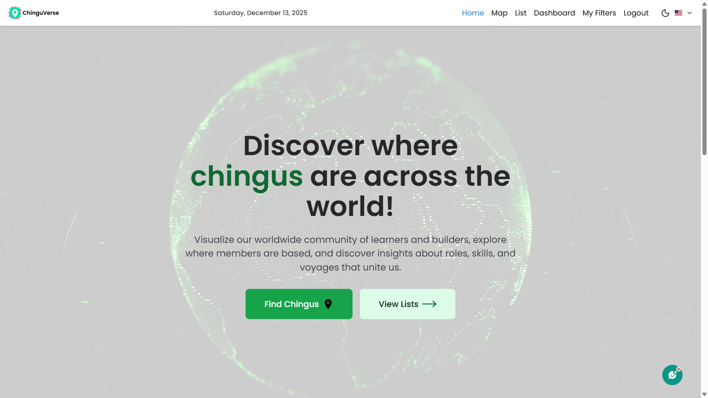

# ChinguVerse




### Table of Contents
- [Project URL](#demo)
- [Description](#description)
- [Features](#features)
- [Technologies Used](#technologies-used)
- [Special Thanks](#special-thanks)
- [Team Members](#our-team)
- [Setup Instructions](#setup-Instructions)


## Demo

[URL](https://chingu-voyages.github.io/V58-tier3-team-35/)

## Description

ChinguVerse! 🌍 is a friendly web app brings together Chingu developers from around the world on an interactive map. Discover where your fellow Chingus are located, explore demographic insights, and connect with the global developer community. ChinguVerse makes it easy and fun to visualize our worldwide network.

## Features

- **Map Page**
    - Shows the total number of Chingus in a country.

- **List Page**
    - Displays a paginated and sort list of Chingus
    - the list attributes include:
        - Gender  
        - Country 
        - Year joined (from Timestamp)  
        - Role type  
        - Source
        - Voyage Role    
        - Goal  

- **Search functionality**
    - Search or Filter chingus based on the combination of any of the following:
        - Keyword (country, timezones etc)
        - Gender  
        - Source  
        - Goal  
        - Solo Project Tier  
        - Voyage Role 
        - Role type
        - Submit and Clear buttons update or reset results.

- **Dashboard**
    - Displays demographic insights about Chingus using charts and graphs.

- **My Filters**
    - Save frequently used search filters for quick access.

- **AI chatbot (Versie)**
    - Get instant answers to your questions on how to navigate the web app.

- **Modern UI / UX**
    - Responsive design optimized for all devices
    - Tailwind CSS for modern, consistent styling
    - Dark mode support


## Technologies Used
- **language**: Typescript

- **Frontend**
    - React
    - Chakra UI
    - Leaflet.js
    - Vite
    - ReCaptcha


- **Backend**
    - NodeJS
    - Express.js
    - MongoDB
    - GEMINI AI API
    - GitHub Pages
    - Render

- **Tools**
    - Figma

## Special Thanks

- **Chingu**: For organizing This Voyage and providing this amazing opportunity
- **All Contributors**: For their dedication and hard work
- **Open Source Community**: For the amazing tools and libraries
- **Special Thanks** : To the Scrum master, project head and voyage Guide

## Our Team

This project was developed by an amazing team as part of Chingu Voyage 58:

- Onyekachi Nwakaihe (Kachi) #1: [GitHub](https://github.com/donkachii) / [LinkedIn](https://linkedin.com/in/onyekachi-nwakaihe)
- Zuzu Ali #2: [GitHub](https://github.com/zuweeali) / [LinkedIn](https://linkedin.com/in/zuwaira-aliyu-mohammed)
- Chinedu Olekah #3: [GitHub](https://github.com/kenako1) / [LinkedIn](https://linkedin.com/in/chinedu-olekah)
- Afuwape Babatunde #4: [GitHub](https://github.com/Afubasic) / [LinkedIn](https://www.linkedin.com/in/afuwape-babatunde-258735382)
- Ogechi Ogharandukun #5: [GitHub](https://github.com/AdoarableOge) / [LinkedIn](https://www.linkedin.com/in/Ogechi-Ogharandukun)
- Nsowah Alexander #6(Recklessbud) [Github](https://github.com/recklessbud)

- Voyage Guide: Lindsay Allen #7 [GitHub](https://github.com/lkallen) / [LinkedIn](https://www.linkedin.com/in/lindsay-allen-54b46937/)


## Setup Instructions
1. Clone the repository:  
   ```bash
   git clone <repo-url> 

2. **Navigate to the project folder**  

  Backend Setup

   1. Navigate to the backend directory:
        ```bash
        cd backend

   2. Install backend dependencies:
        ```bash
        npm install

   3. Create and configure the environment file:
       - In the backend directory, create a new file named .env.
       - Copy the contents of .env.example into your new .env file.
       - Fill in the required values:
           - PORT: The port for the backend server (e.g., 2334).
           - CONNECTION_URI: Your MongoDB connection string.
           - APP_KEY: A secret key for your application.
           - RECAPTCHA_SECRET_KEY: Your Google reCAPTCHA secret key.
           - GOOGLE_GEMINI_API_KEY: Your Google Gemini API key.
   
   4. Start the backend development server:
        ```bash
        npm run dev
      

  **Frontend Setup**

   1. Navigate to the frontend directory:
      (If you are in the backend directory, go back to the root first: cd ..)
        ```bash
        cd frontend

   2. Install frontend dependencies:
        ```bash
        npm install

   3. Start the frontend development server:
        ```bash
        npm run dev